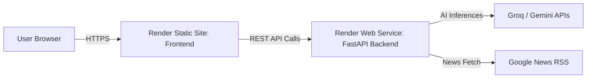

# TruthLens Cloud Deployment Guide

You can deploy **both the Backend and Frontend on Render** (all-in-one dashboard) or deploy the frontend on **Netlify**. Both setups are 100% free.

---

## 🎯 Option 1: Deploy Both Backend & Frontend on Render (Recommended)

Render provides **Web Services** (for Python FastAPI) and **Static Sites** (for React/Vite). You can host both under the same Render account for free.

### Step 1: Deploy Backend on Render (Web Service)
1. Go to [Render Dashboard](https://dashboard.render.com/) and click **New +** $\rightarrow$ **Web Service**.
2. Connect your repo: `immortal-temp/truthlens`.
3. Configure settings:
   - **Name**: `truthlens-api`
   - **Root Directory**: `backend`
   - **Runtime**: `Python 3`
   - **Build Command**: `pip install -r requirements.txt`
   - **Start Command**: `uvicorn app.main:app --host 0.0.0.0 --port $PORT`
   - **Instance Type**: `Free`
4. Add **Environment Variables**:
   - `GROQ_API_KEY` = `gsk_...`
   - `GROQ_MODEL` = `openai/gpt-oss-120b`
   - `GEMINI_API_KEY` = `AIzaSy...`
   - `GEMINI_MODEL` = `gemini-3.6-flash`
   - `CORS_ORIGINS` = `*`
   - `MONGODB_URI` = *(Optional: MongoDB Atlas URI or omit for in-memory)*
   - `DEMO_MODE` = `false`
5. Click **Create Web Service** and copy your live backend URL (e.g. `https://truthlens-api.onrender.com`).

---

### Step 2: Deploy Frontend on Render (Static Site)
1. In your Render dashboard, click **New +** $\rightarrow$ **Static Site**.
2. Connect the same repo: `immortal-temp/truthlens`.
3. Configure settings:
   - **Name**: `truthlens` *(or `truthlens-web`)*
   - **Root Directory**: `frontend`
   - **Build Command**: `npm run build`
   - **Publish Directory**: `dist`
4. Add **Environment Variables**:
   - `VITE_API_BASE_URL` = `https://truthlens-api.onrender.com` *(Your Render backend URL from Step 1)*
5. Configure **Redirects/Rewrites** (for React Router support):
   - Go to **Redirects/Rewrites** tab on your Render static site settings.
   - Click **Add Rule**:
     - **Source**: `/*`
     - **Destination**: `/index.html`
     - **Action**: `Rewrite`
6. Click **Create Static Site**.
7. Render will build and launch your frontend with free SSL and global CDN!

---

## 🌐 Option 2: Deploy Backend on Render + Frontend on Netlify

If you prefer using **Netlify** for the frontend:

### Step 1: Deploy Backend on Render
*(Follow Step 1 from Option 1 above)*

### Step 2: Deploy Frontend on Netlify
1. Go to [Netlify](https://app.netlify.com/) $\rightarrow$ **Add new site** $\rightarrow$ **Import an existing project**.
2. Select `immortal-temp/truthlens`.
3. Configure settings:
   - **Base directory**: `frontend`
   - **Build command**: `npm run build`
   - **Publish directory**: `frontend/dist`
4. Add Environment Variable:
   - `VITE_API_BASE_URL` = `https://truthlens-api.onrender.com` *(Your Render backend URL without trailing slash)*
5. Click **Deploy Site**.

---

## 🔍 Verification & Health Checklist

1. **Verify Backend Health**:
   - Open `https://<your-backend>.onrender.com/api/health` in your browser.
   - Expect: `{"status": "healthy", ...}`.

2. **Verify Frontend**:
   - Open your Render static site or Netlify URL.
   - Run a test verification:
     > *"ISRO has successfully sent the Earth observation satellite, EOS-05, into space."*
   - Verify the score gauge, supporting articles, date analysis, and structured report load accurately.

3. **Verify Route Refresh**:
   - Navigate to `/history` and refresh (`F5`).
   - The page should reload directly without a 404.

---

## 🛠 Troubleshooting

| Issue | Cause | Solution |
| :--- | :--- | :--- |
| **CORS error in browser console** | Backend blocked frontend origin | Set `CORS_ORIGINS=*` in Render backend environment variables. |
| **404 on page refresh on Render Static Site** | SPA rewrite rule missing | In Render Static Site $\rightarrow$ Redirects/Rewrites, add `/*` $\rightarrow$ `/index.html` (Rewrite). |
| **404 on page refresh on Netlify** | SPA redirect rule missing | Handled automatically by `frontend/public/_redirects`. |
| **Frontend calls `localhost:8000`** | `VITE_API_BASE_URL` not set | Set `VITE_API_BASE_URL=https://<your-backend>.onrender.com` in frontend environment settings and redeploy. |
| **Free Tier Cold Start (~30s delay)** | Render free tier sleep after 15m | Normal behavior for free web services. Once woken up, requests respond in $<1$s. |
