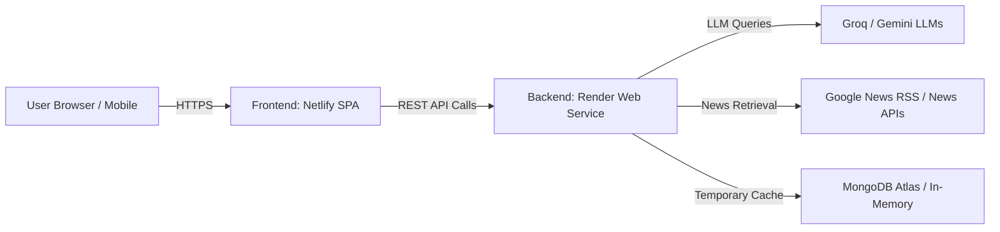

# TruthLens Cloud Deployment Guide (Render + Netlify)

This guide walks you through deploying **TruthLens** with the **FastAPI Backend on Render** and the **React + Vite Frontend on Netlify**.

---

## 🏗 Architecture Overview

---

## 🚀 Part 1: Deploy Backend on Render

### Step 1: Create a New Web Service on Render
1. Go to [Render Dashboard](https://dashboard.render.com/) and sign in with your GitHub account (`immortal-temp`).
2. Click **New +** $\rightarrow$ **Web Service**.
3. Select **Build and deploy from a Git repository** and connect your repo: `immortal-temp/truthlens`.

### Step 2: Configure Service Settings
Configure the service with the following settings:

| Field | Setting Value |
| :--- | :--- |
| **Name** | `truthlens-api` *(or your preferred name)* |
| **Region** | Choose the closest region (e.g., `Singapore`, `Frankfurt`, `Oregon`) |
| **Branch** | `main` |
| **Root Directory** | `backend` |
| **Runtime** | `Python 3` |
| **Build Command** | `pip install -r requirements.txt` |
| **Start Command** | `uvicorn app.main:app --host 0.0.0.0 --port $PORT` |
| **Instance Type** | `Free` |

---

### Step 3: Add Backend Environment Variables
Under the **Environment Variables** section on Render, add the following keys:

| Environment Variable | Recommended Value / Description |
| :--- | :--- |
| `GROQ_API_KEY` | `gsk_...` *(Your Groq API key for ultra-fast structured synthesis)* |
| `GROQ_MODEL` | `openai/gpt-oss-120b` |
| `GEMINI_API_KEY` | `AIzaSy...` *(Your Google Gemini API key)* |
| `GEMINI_MODEL` | `gemini-3.6-flash` |
| `CORS_ORIGINS` | `*` *(Or comma-separated domains like `https://your-site.netlify.app`)* |
| `MONGODB_URI` | `mongodb+srv://...` *(MongoDB Atlas connection string, or omit for in-memory mode)* |
| `MONGODB_DB_NAME` | `truthlens` |
| `MONGODB_TTL_SECONDS` | `1200` |
| `DEMO_MODE` | `false` |

> [!TIP]
> **Free Tier Cold Starts**: Render puts free web services to sleep after 15 minutes of inactivity. The first request after sleep may take ~30 seconds to spin up.

### Step 4: Deploy & Copy Backend URL
1. Click **Create Web Service**.
2. Wait for the build and deployment logs to show `Application startup complete`.
3. Copy your live backend URL (e.g., `https://truthlens-api.onrender.com`).
4. Test in browser by visiting: `https://truthlens-api.onrender.com/api/health`.

---

## 🌐 Part 2: Deploy Frontend on Netlify

### Step 1: Import Project to Netlify
1. Go to [Netlify Dashboard](https://app.netlify.com/) and sign in.
2. Click **Add new site** $\rightarrow$ **Import an existing project**.
3. Select **GitHub** and authorize access to `immortal-temp/truthlens`.

### Step 2: Configure Build & Directory Settings
Under **Site configuration**, set:

| Field | Setting Value |
| :--- | :--- |
| **Base directory** | `frontend` |
| **Build command** | `npm run build` |
| **Publish directory** | `frontend/dist` |
| **Branch to deploy** | `main` |

---

### Step 3: Add Frontend Environment Variables
Under **Site configuration** $\rightarrow$ **Environment variables**, click **Add variable** and add:

| Key | Value | Note |
| :--- | :--- | :--- |
| `VITE_API_BASE_URL` | `https://truthlens-api.onrender.com` | **Replace with your actual Render backend URL** |

> [!IMPORTANT]
> Do NOT include a trailing slash `/` at the end of `VITE_API_BASE_URL`. For example, use `https://truthlens-api.onrender.com`, not `https://truthlens-api.onrender.com/`.

---

### Step 4: Deploy Frontend
1. Click **Deploy Site**.
2. Netlify will run `npm run build` and publish your production bundle.
3. Once deployed, Netlify provides a live URL (e.g., `https://truthlens.netlify.app`).

---

## 🔍 Part 3: Verification & Health Checklist

1. **Verify Backend Health**:
   - Open `https://<your-render-app>.onrender.com/api/health` in your browser.
   - Expect: `{"status": "healthy", ...}`.

2. **Verify Frontend Connectivity**:
   - Open your Netlify URL (e.g., `https://truthlens.netlify.app`).
   - Run a test verification:
     > *"ISRO has successfully sent the Earth observation satellite, EOS-05, into space."*
   - Verify the 0–100 Evidence Score, supporting articles, date analysis, and structured report render smoothly.

3. **Verify Routing & Refresh**:
   - Navigate to `/history` or a specific results page (`/results/<id>`).
   - Refresh the browser page (`F5`).
   - The page should reload directly without a 404 (handled by `public/_redirects`).

---

## 🛠 Troubleshooting

| Issue | Cause | Solution |
| :--- | :--- | :--- |
| **CORS error in browser console** | Backend didn't allow Netlify domain | Set `CORS_ORIGINS=*` in Render environment variables. |
| **404 on page refresh on Netlify** | SPA router missing redirect rule | Ensure `frontend/public/_redirects` contains `/* /index.html 200`. |
| **Frontend calls `http://localhost:8000` instead of Render** | `VITE_API_BASE_URL` not configured | Add `VITE_API_BASE_URL=https://<your-render-url>` in Netlify settings and trigger a redeploy. |
| **Groq / Gemini quota error** | Invalid or missing API key | Check your Render environment variables and ensure `GROQ_API_KEY` / `GEMINI_API_KEY` are valid. |
